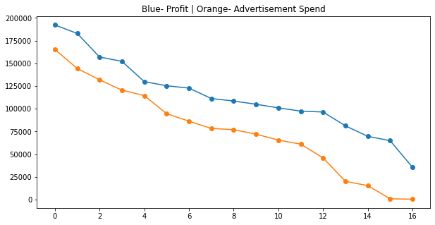
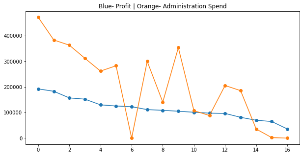
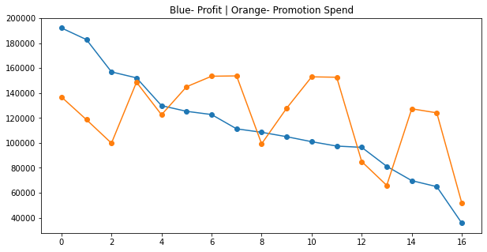
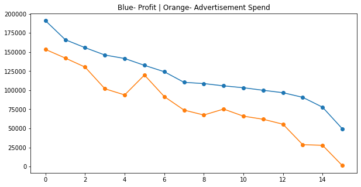
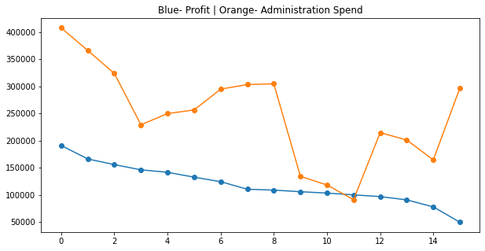
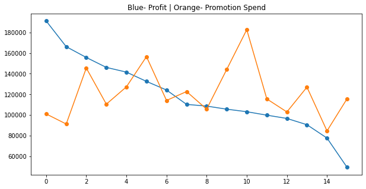
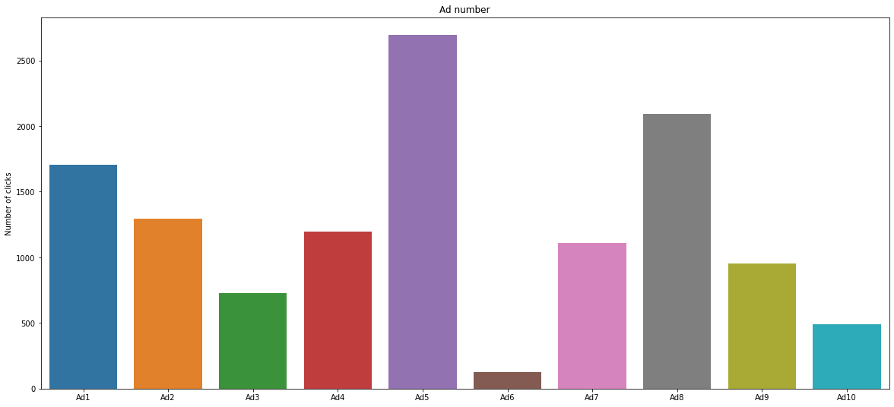
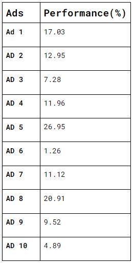

The data set is taken from a Supermarket(name is not revealed) which has various franchises in regions of the United States. The organization has been operating since 2008 and this data contains information by the end of 2016. Their annual revenues have declined 10% and it seems to stay that way every year. This [dataset](https://www.kaggle.com/sindraanthony9985/marketing-data-for-a-supermarket-in-united-states) is just the part of a bigger data which is not publicly available. 
Following are the datasets which are made public for analytics:
* 50SupermarketBranches.csv contains the information of 50 supermarket branches such as their spending on the advertisement, administration and promotion, states and profits.
* AdsCTROptimisation.csv is based on the Click-Through Rates (CTR) from 10000 users in 10 different advertisements.
* MarketBasketOptimisation.csv . This dataset contains 7500 sales transactions in a week.
* Supermarket_CustomerMembers.csv . This dataset can be used for customer segmentation.
**AIM** : To perform EDA on the datasets and generate insights for the supermarket to earn better profits and overcome their 10% loss trend.

For each dataset, separate notebooks were constructed to generate insights. Following are the respective names of notebooks:
* [state-profits-eda](https://github.com/Rushanksavant/US-Supermarket-EDA/blob/main/state-profits-eda.ipynb)
* [ads-eda](https://github.com/Rushanksavant/US-Supermarket-EDA/blob/main/ads-eda.ipynb)
* [basket-items-eda](https://github.com/Rushanksavant/US-Supermarket-EDA/blob/main/basket-items-eda.ipynb)
* [customer-behavior-eda](https://github.com/Rushanksavant/US-Supermarket-EDA/blob/main/customer-behavior-eda.ipynb)

# Insights
## 1. From 50SupermarketBranches.csv (state-profits-eda)
The data was collected from stores in three different cities namely New York, California, Florida. It was needed to generate insights about the effect on profits due to Advertisement Spend, Promotion Spend and Administration Spend by the Supermarket agency.
The dataset was segmented into 3 parts(each for 1 city) and then visualized.

### 1. For California

 

 

 

From the above plots, following **insights** can be generated:
1. The less spent on Advertisements led to decrease in profits
2. Despite high spending on administration, the profits kept on falling. The rise and fall in administration spending did not affect the overall fall of profits.
3. The Promotion spends followed much similar trends as Administration spends, but on the 150000 spend in Promotion the profits experienced a small increase in spite of fall in Advertisement spend. 
4. Hence, it was required to cut-off spends on administration and increase on advertisements(majorly) and promotion.
 

### 2. For New York

 

 

 

From the above plots, following **insights** can be generated:
1. The Advertising spent seems to affect the Profits in New York as well.
2. The Administration spent has no effect on profits
3. In New York the promotion spend seems to affect Profits(unlike California which had low effects)
4. Hence, the Administration spend should  be decreased and Advertisement and Promotion spends needs to be increased.
 

### 3. For Florida

 

 

 

From the above plots, following **insights** can be generated:
1. The trends seem quite similar to that of California
2. But there is one point in the plot which needs to be entertained, when 125500 was the spend on Advertisement, profits were expected to increase but that didn't happen. On the same point, the promotion spend was also increased, still the profits faced a fall. Now if we consider that’s due to Administration spend, that’s also not possible as these spends were also increased at that point. Hence the reason for this fall in profit cannot be determined using this dataset, although research can be done by the authorities about market situation, inside corruption, negative word of mouth, negative publicity which must have taken place during that period.
 
 

## 2. AdsCTROptimisation.csv (ads-eda)
The dataset contains Click-through rates(clicked/not, 1/0) from 10000 users in 10 different advertisements. It was needed to know which ads were most effective to attract customers and which ads needed to pull down.  
 

Following is the visualisation: 

 

As it clearly shows which ads performed well and which didn't, there was still a point which needed attention. When the percentage performance of each ad were analysed, following were the results:

As you can see in the above table, none of the ads is performing well(even the best is 26.95%). The reason behind this was seen in **50SupermarketBranches.csv (state-profits-eda)**, the Advertisement spend was decreased in all states and that affected profits.
Hence it is very necessary to increase investment on ads like Ad 5, Ad 8, Ad 1 and pull down rest and develop new.

## 3. From MarketBasketOptimisation.csv (basket-items-eda):
Each entry of this data contains products purchased by a customer at the store.Although the data is just for a week but have 7500 transactions, which are enough to estimate and frame immediate sale schemes, offers, discount announcements to attract customers.  
 
Firstly, the top 20 selling products were listed which included Mineral water(1788 sold), Eggs (1348 sold), Spaghetti (1306 sold) and more. So by now it was known which products are in most demand.

 

Secondly, the most selling groups of  products(products which were sold together) were found.

 

Lastly, the average number of items bought by a customer in a single transaction was found to be 3 items.
So now:  
The less selling products can be provided on some discounts on the purchase of 2 or 3 most selling products. This will attract customers more towards the most selling products, and will increase sales of both(most and least sold) kinds of products.  
One such combination can be - On the purchase of Chocolates & Pancakes, Frozen Smoothies are provided with an attractive discount.
 

## 4. Supermarket_CustomerMembers.csv (customer-behavior-eda)
This dataset contains the customer information(Gender, Age, Annual Income, Spending Score):
 

 
Firstly, the maximum and minimum ages(70, 18) of customers were found, then customers were segmented into groups based on their ages. And a new column(‘Age Group’) was added to the data having the following elements(based on their age) :  

* Under 20 years
* 20 to 24 years
* 25 to 29 years
* 30 to 34 years
* 35 to 39 years
* 40 to 44 years
* 45 to 49 years
* 50 to 54 years
* 55 to 60 years
* 60 and above years
 
Then the Gender distribution in each group were analysed:

 

Then coming to Annual income(k$) of customers, maximum income was found to be 137k$ and minimum was 15k$.
The Annual Income distribution based on Age Group and Gender was as follows:  

 

Next, coming to the Spending score(1-100) of customers, the maximum was 99 and minimum was 1. The Spending Score distribution based on Age Group and Gender was:  

 

It was required to know the distribution of Annual Income with Spending Score, Gender, and Age Group, and hence following analysis were done:  

 

 

Following Insights(for customers) can be generated using the above information: 

* In the age group of 45-49 the income of females is high, but their spending score needs to be increased. This can be done by researching which kind of products are most frequently bought by people under that age group, and investing in publicizing that kind of advertisements, promotions.
* The Age Groups of 30-34, 35-39 and 25-29 have the highest spending scores. These groups should be more attracted using discount strategies as they are sure to spend more.
* The age groups of Under 20 years and 20-24, need to be happy with the supermarket. As these people will be the future customers. To keep them binded,special advertisements, promotional activities(competitions, games, shows, etc) can be conducted.
